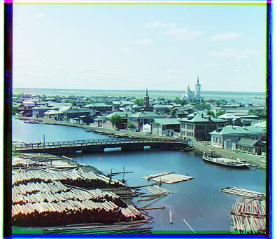
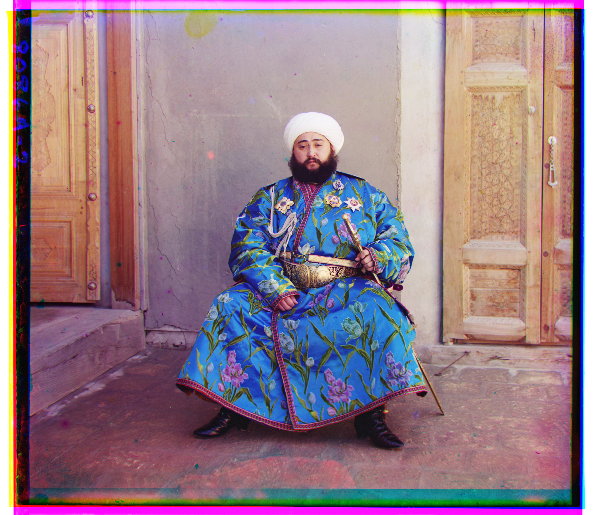
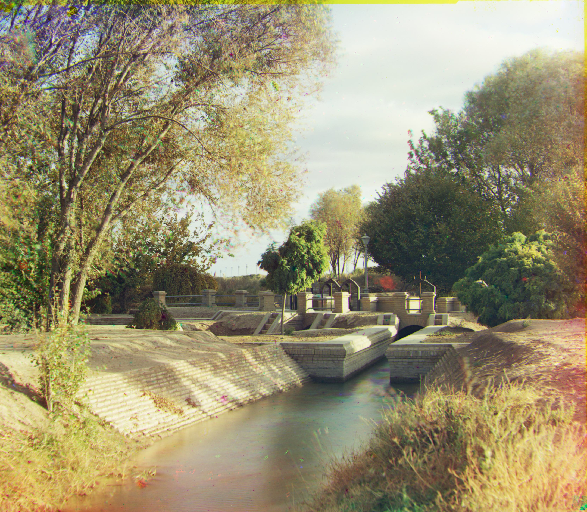

# Project: Images of the Russian Empire

# Overview
The project seeks to align the images from RGB channels as each channel was separately taken by the photographer

To do so, we need to translate two of the channels on x and y axis so that they align with the other one channel. Finally, we stack the three channels together to get one RGB image

# Main idea
## Search Window
For small images, we could use one search window to exhaustively look for the right offset with a loss function such as SSD and NCC. A search window of [-15, 15] is good enough

## Image Pyramid
For large images, exhaustive search is too consuming, so we could rescale the image into half of its size and use the offsets found in the smaller images as an estimate to the offsets of the larger ones. As a result, we could use much smaller search windows to align the images

The search depth is dependent on the image size. Larger the image size, larger the search depth: log(h)/log(shrink ratio)
The shrink ratio and the search window size I use are 0.75 and 4 respectively.

# Tricks and Techniques
## Central cropping
There are considerable noises around the sides of the images. This could temper the performance of the alignments! Thus, it is practical to only evaluate the central region of the images. 
For large images, I use the central 80% to evaluate the alignment metric. For small images, no cropping is necessary.

## Alignment base
After trying to each of r, g, b channels as the base of alignment, I found that aligning with green channel yields better result.

# Bells and wistles
## Automatic cropping
Since the provided images have similar boundaries, I make a fixed-ratio cropping (crop 20% out) and that has already shown great enough results.
Below are comparisons of images with and without automatic cropping

## Automatic contrast
To make automatic contrast, I make use of the idea of Histogram Equalization
Basically, it adjusts the pixel values to enhance the contrast by making the intensities more equal. 
A typical image often has a histogram that follows a Gaussian distribution, but we want the histogram to be more uniformly distributed.

Here images on the left are automatically cropped and contrasted; images on the right are only automatically cropped

## Raw Aligned Results

## Offsets Table

| Image         | Red shift   | Blue shift    |
| :---          |    :---:   |          ---: |
| Cathedral     | (7, 0)       | (-1, 1)   |
| Monastery     | (6, 1)        | (6, 0)      |
| Tobolsk       | (4, 1)        | (-3, -2)      |
| church        |  (33, -7)       | (-25, 0)      |
| emir          | (57, 17)        | (-49, -24)      |
| harvesters    | (65, -3)        | (-60, -16)      |
| icon          | (48, 5)        | (-40. -17)      |
| lady          | (63, 3)        | (-53, -8)      |
| melons        | (96, 3)        | (-82, -8)      |
| onion church  | (57, 10)        | (-51, -26)      |
| sculpture     | (107, -16)        | (-33, 11)      |
| self portrait | (98, 8)        | (-78, -28)      |
| 3 generations | (58, -1)        | (-54, -11)      |
| train         | (43, 27)        | (-43, -5)      |

## Additional images of my choice

